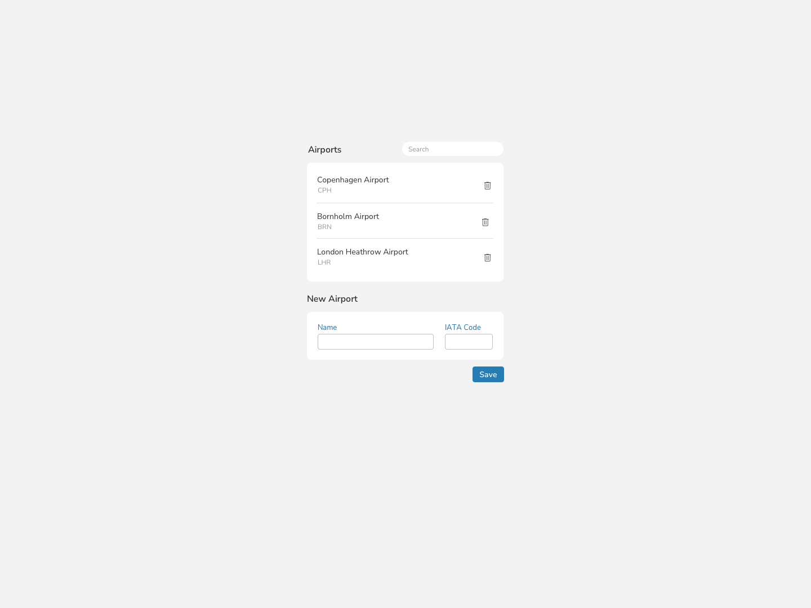

# PDC Frontend Opgave

## Formålet

Denne app er et led i PDC's ansættelsesprocedure. Målet er at teste en ny frontend medarbejder i React og se hvordan nogle af de problemstillinger der fremstilles bliver løst.

Det er ikke et krav at nå alt og der er ikke noget rigtig eller forkert. Brug 2-3 timer på det.

## Opgaven

Du skal lave en simpel app der viser en liste af lufthavne.

1. Vis en liste af lufthavne fra backenden (se afsnittet [Backend](#backend)).
1. Style listen med SCSS (se afsnittet [Design brief](#design-brief)).
1. Man skal kunne tilføje en ny lufthavn.
1. Man skal kunne slette en lufthavn.
1. Man skal kunne søge/filtrere i listen.
1. Hvis du har tid: Tilføj mulighed for editering af lufthavne.

## Værd at bemærke

- Der er allerede lavet et begyndende udkast til hvordan data fra backenden kan hentes (se `api.ts`) - du vælger selv om du vil arbejde videre med den eller en anden løsning.
- Husk, det vigtige er ikke hvordan du løser opgaven. Det vigtige er at du kan forklare hvorfor du har valgt at løse opgaven på den måde du har.

## Design brief

Følg gerne dette design brief (`./design-brief.png`) - det behøver dog ikke matche 100%:



### Farver

- Baggrundsfarve: #F3F3F3
- Primær font farve + ikoner: #2F2F2F
- Sekundær font farve: #979797
- Label font farve: #1F6EA2
- Knap farve: #277CB4

## Backend

Det hele skal gemmes i en backend. Her har du en JSON Server tilgængelig.

En JSON Server skal blot startes, og så overvåger den en db.json fil og exposer samtidigt de nødvendige endpoints.

Du kan starte serveren ved at køre:

```
npm run backend
```

Serveren kører på port http://localhost:5000 (porten kan ændres i package.json).

Endpoints tilgængelig er:

```
GET    /airports
GET    /airports/<id>
POST   /airports
PUT    /airports/<id>
PATCH  /airports/<id>
DELETE /airports/<id>
```

Du kan se flere detaljer om de tilgængelige endpoints her: [https://github.com/typicode/json-server](https://github.com/typicode/json-server#routes)
